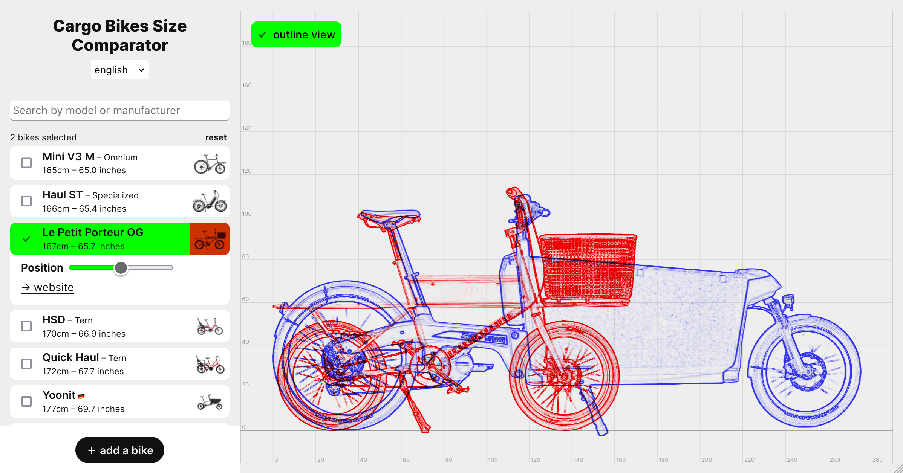

# Cargo Bikes Size Comparator



Source code for https://bikes.louiseveillard.com/

Contributions welcome.

To contribute a bike, refer to https://github.com/louis-ev/Cargo-Bikes-Size-Comparator/issues/9

If necessary, upscale image with https://www.iloveimg.com/upscale-image

Remove background with https://bg.addy.ie/ (or https://new.express.adobe.com).

Optimize images with ImageOptim, if possible.

To contribute with code, follow these instructions:

## Recommended IDE Setup

[VSCode](https://code.visualstudio.com/) + [Volar](https://marketplace.visualstudio.com/items?itemName=Vue.volar) (and disable Vetur).

## Customize configuration

See [Vite Configuration Reference](https://vitejs.dev/config/).

## Project Setup

```sh
npm install
```

### Compile and Hot-Reload for Development

```sh
npm run dev
```

### Compile and Minify for Production

```sh
npm run build
```

### Lint with [ESLint](https://eslint.org/)

```sh
npm run lint
```

<h2 id="commit">Commit Convention Rules</h2>

Structure of commit messages

```
<type>[optional scope]: <description>

[optional body]

[optional footer(s)]
```

Example commit message:

```
git commit -m "feat(bike): Riese and Muller LOAD 100 XL
git commit -m "fix(util): xhr logic issue with network save"
git commit -m "chore: add commit convention type/scope rules"
```

Example breaking change commit message:

```
git commit -m "feat(component): change api for ix-btn component

BREAKING CHANGE: `extends` key in config file is now used for extending other config files"
```

### Major, Minor, Patch

The commit contains the following structural elements, to communicate intent to the consumers of your library:

1. fix: a commit of the type fix patches a bug in your codebase (this correlates with PATCH in Semantic Versioning).
1. feat: a commit of the type feat introduces a new feature to the codebase (this correlates with MINOR in Semantic Versioning).
1. BREAKING CHANGE: a commit that has a footer BREAKING CHANGE:, or appends a ! after the type/scope, introduces a breaking API change (correlating with MAJOR in Semantic Versioning).

### Types

Commit messages must be one of the following:

    build: Changes that affect the build system or external dependencies (example scopes: gulp, broccoli, npm)
    chore: miscellaneous(setting up eslint, stylelint, etc)
    ci: Changes to our CI configuration files and scripts (example scopes: Travis, Circle, BrowserStack, SauceLabs)
    docs: Documentation only changes
    feat: A new feature
    fix: A bug fix
    perf: A code change that improves performance
    refactor: A code change that neither fixes a bug nor adds a feature
    style: Changes that do not affect the meaning of the code (white-space, formatting, missing semi-colons, etc)
    test: Adding missing tests or correcting existing tests
