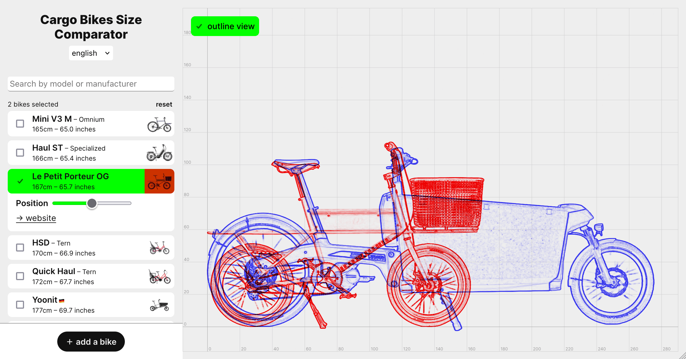

# Cargo Bikes Size Comparator



Source code for https://bikes.louiseveillard.com/

Contributions welcome.

## Bike database

Bike metadata (manufacturer, model, length, margins, materials, etc.) lives in [`src/assets/bikes.json`](src/assets/bikes.json). Profile images are in [`src/assets/bikes/`](src/assets/bikes/).

> **Note:** this file was previously named `bike_images.json`. Update any bookmarks or scripts that still point to the old path.

To contribute a bike, refer to https://github.com/louis-ev/Cargo-Bikes-Size-Comparator/issues/9

If necessary, upscale image with https://www.iloveimg.com/upscale-image

Remove background with https://bg.addy.ie/ (or https://new.express.adobe.com).

Optimize images with ImageOptim, if possible.

To contribute with code, follow these instructions:

## Recommended IDE Setup

[VSCode](https://code.visualstudio.com/) + [Volar](https://marketplace.visualstudio.com/items?itemName=Vue.volar) (and disable Vetur).

## Customize configuration

See [Vite Configuration Reference](https://vitejs.dev/config/).

## Project Setup

```sh
npm install
```

### Compile and Hot-Reload for Development

```sh
npm run dev
```

### Compile and Minify for Production

```sh
npm run build
```

### Lint with [ESLint](https://eslint.org/)

```sh
npm run lint
```
